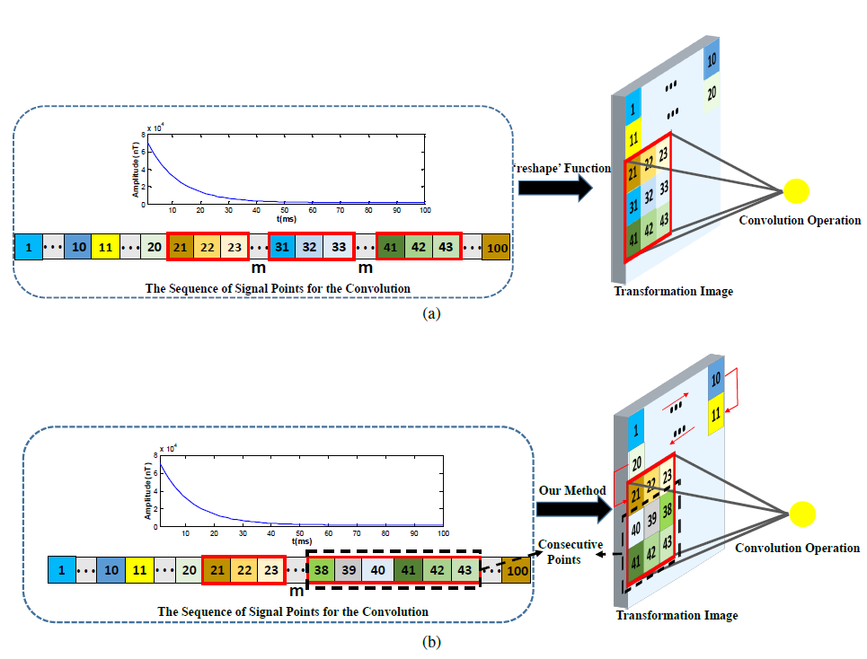

# TEMDnet_demo
This project is for a paper called "TEMDnet: A Novel Deep Denoising Network for Transient Electromagnetic Signal with Signal-to-Image Transformation". It is worth pointing out that we don't upload the datasets to this git repository due to the datasets are connected with the secrecy of project. Luckily, we will provide overall datasets in the future. If you have questions,please feel free to contact me. Finally, my Email is cs.ckc96@gmail.com , which is often uesed.
## Overall Idea
Recently,data-driven denoising methods have achieved impressive perfromace, where deep Convolutional Neural Networks (CNN) based natural image denoising methods is the most booming field. Thus, an interesting question may be existed, i.e., Can we remove the noise from acquired TEM signal by the state-of-the-art image denoising methods? To this end, we first achieve a novel signal-to-image transformation method in order to keep the structual information of TEM signal as much as possible. We then propose a novel CNN-based denoiser to modeling the noise. 
## Visualized Conponents 
1) signal-to-image transformation method

2) the proposed CNN-based denoiser
## Experimental Results
### On simulated data
### On real-world data
